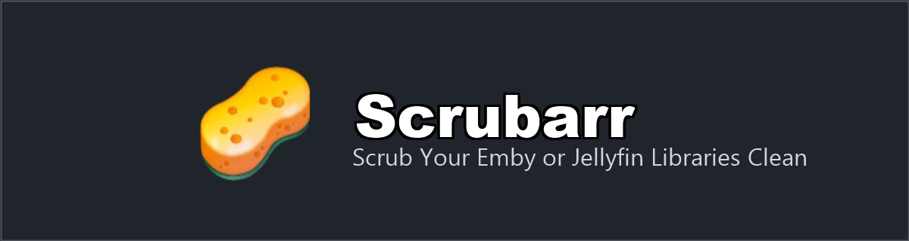
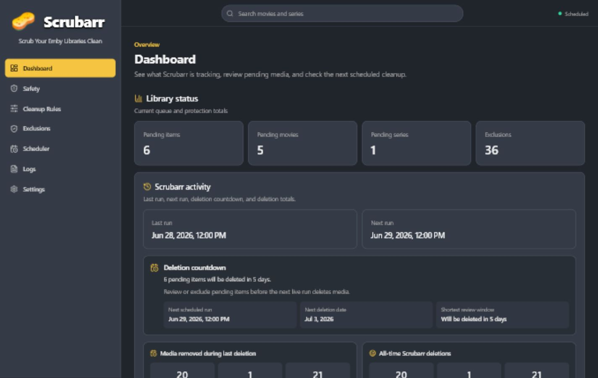
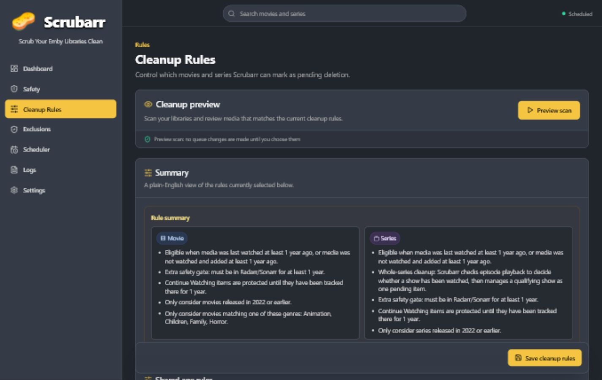
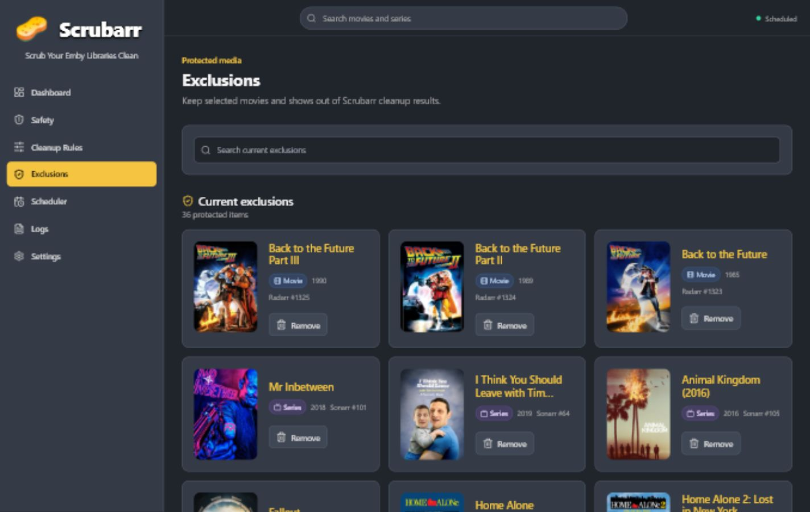
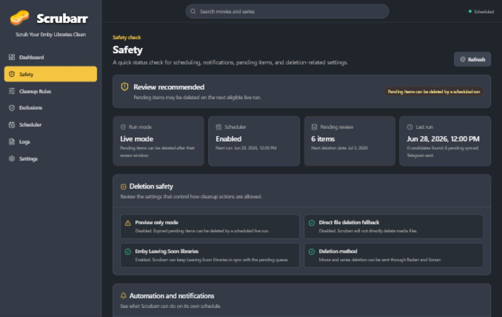

<p align="center">
  
</p>

Scrubarr is a self-hosted cleanup app for Emby or Jellyfin libraries. It scans
your media with rules you control, places matching items into a pending review
queue, shows those items in Leaving Soon libraries, sends optional Telegram
notifications, and deletes expired pending media through Radarr and Sonarr.

Scrubarr is built for admins who want a clear last-chance review workflow before
old media is removed.

## Screenshots

| Dashboard | Cleanup rules |
| --- | --- |
|  |  |

| Exclusions | Safety |
| --- | --- |
|  |  |

## What It Does

- Scans movies and series from Emby or Jellyfin.
- Uses watched age, never-watched age, release year, genre, and queue-limit
  rules.
- Adds eligible media to a pending deletion queue.
- Creates Leaving Soon libraries with `.strm` files so users can see what is
  pending.
- Lets you remove pending items or protect them with exclusions.
- Sends Telegram summaries, reminders, deletion reports, and critical alerts.
- Deletes expired pending media through Radarr and Sonarr.
- Keeps logs, backups, deletion history, and dashboard stats.
- Checks for signed Scrubarr updates.

See [FEATURES.md](FEATURES.md) for a plain-English explanation of each area.

## Status

Scrubarr is early release software.

Emby is the primary tested media-server path. Jellyfin support is available, but
you should test it carefully in your own setup before relying on live deletion.

Always start with **Preview only mode** enabled. Review preview results, pending
items, Leaving Soon libraries, logs, and Telegram messages before allowing live
deletion.

## Install

The recommended install method is Docker.

- [Windows install steps](INSTALL.md#windows-install)
- [Linux install steps](INSTALL.md#linux-install)
- [First setup checklist](INSTALL.md#first-setup)
- [Updating Scrubarr](INSTALL.md#updates)

## Important Safety Notes

Scrubarr can delete media through Radarr and Sonarr, so treat it like an admin
tool.

- Do not expose Scrubarr directly to the internet without HTTPS and strong
  authentication.
- Built-in basic authentication is available, but external authentication through
  a reverse proxy, VPN, or access-control service is recommended for internet
  access.
- Keep Preview only mode enabled until you trust your rules and queue.
- Keep direct file deletion fallback disabled unless you fully understand the
  risk.
- Export a backup before changing major settings or applying updates.

Read [SECURITY.md](SECURITY.md) before exposing Scrubarr outside your local
network.

## Project Note And Disclaimer

Scrubarr started as a personal PowerShell script and was later rebuilt into a
full web app with help from ChatGPT Codex.

This app is provided for personal use only. It comes with no guarantees,
warranties, support commitments, or promises that it will behave correctly in
every environment. You are responsible for checking your own settings, backups,
preview results, pending queue, logs, and media-server behaviour before enabling
live deletion.

The owner/developer is not responsible for unwanted deletions, data loss,
misconfiguration, downtime, or any other result from using Scrubarr.

## Documentation

- [INSTALL.md](INSTALL.md) - Windows and Linux install steps.
- [FEATURES.md](FEATURES.md) - what each Scrubarr feature does.
- [SECURITY.md](SECURITY.md) - security and exposure guidance.
- [RELEASE.md](RELEASE.md) - maintainer release and update checklist.
- [CHANGELOG.md](CHANGELOG.md) - release notes.

## Development

For local development:

```bash
npm install
npm run dev
```

Useful checks:

```bash
npm run lint
npm run build
npm test
npm run release:check
```

Build a local Docker image:

```bash
docker build -t ghcr.io/scrubarr/scrubarr:local .
```
